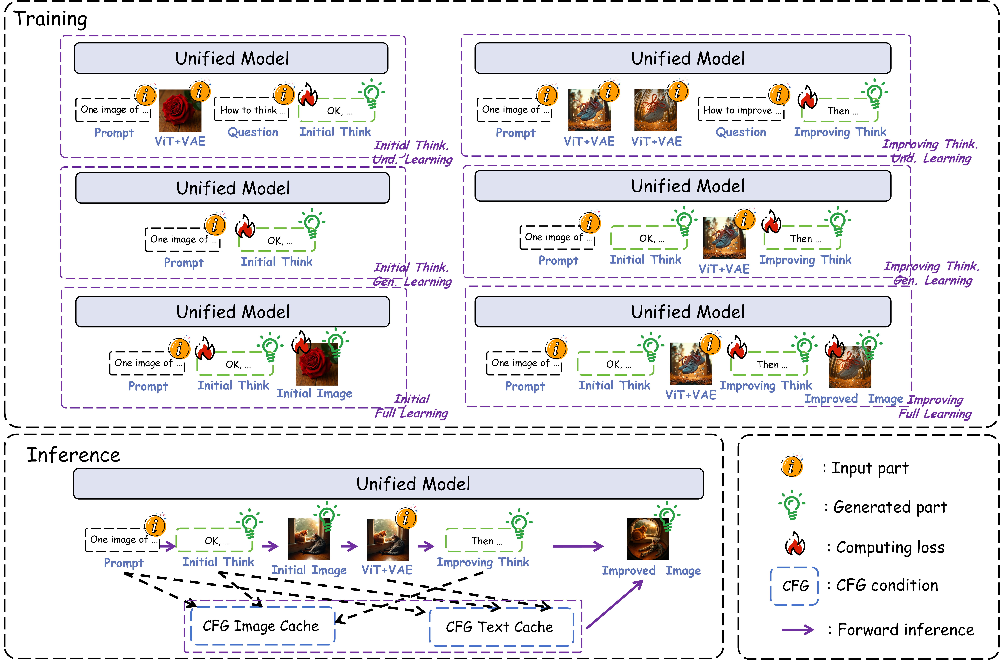

# Interleaving Reasoning Generation
The official repo for "Interleaving Reasoning for Better Text-to-Image Generation".

<p align="center">
       🤗 <a href="https://github.com/Osilly/Interleaving-Reasoning-Generation">IRG</a>&nbsp&nbsp | &nbsp&nbsp🤗 <a href="https://huggingface.co/datasets/Osilly/IRG-Toy-Dataset">IRG-Toy-Dataset</a>&nbsp&nbsp | &nbsp&nbsp📑 <a href="https://arxiv.org/abs/2509.06945">Paper</a>&nbsp&nbsp
</p>

The datasets, code and weights will be released, stay tuned!

## Performance

| Model             | GenEval  | WISE     | TIIF-short/long (Qwen) | GenAI-Bench | OneIG-EN |
| ----------------- | -------- | -------- | ---------------------- | ----------- | -------- |
| Janus-Pro-7B      | 0.80     | 0.35     | 65.38/61.10            | 0.75        | 0.267    |
| FLUX.1-dev        | 0.82*    | 0.50     | 66.24/66.72            | 0.76        | 0.434    |
| Show-o2           | 0.76     | 0.61     | 62.80/63.87            | 0.75        | 0.308    |
| BAGEL             | 0.78     | 0.52     | 70.97/71.79            | 0.79        | 0.361    |
| BAGEL w/ self-CoT | 0.79     | 0.70     | 68.06/68.78            | 0.81        | 0.324    |
| **IRG (Ours)**    | **0.85** | **0.77** | **76.00/73.77**        | **0.84**    | 0.415    |

*: Using the rewrited prompts to evaluation.

## Timeline

- [2025/09/15] **We released [SFT training code](https://github.com/Osilly/Interleaving-Reasoning-Generation/tree/main/SFT) and [IRG-Toy-Dataset](https://huggingface.co/datasets/Osilly/IRG-Toy-Dataset)**!

- [2025/09/08] Our IRG paper ([Interleaving Reasoning for Better Text-to-Image Generation](https://arxiv.org/abs/2509.06945)) can be accessed in arXiv!

## Overview


> As shown in (a), we illustrate an example of Interleaving Reasoning Generation (IRG).  Given a prompt, the model first produces a text‑based reasoning process and then generates an image conditioned on that reasoning. Next, building upon the initial image, the model reflects on how to improve its quality and produces a refined image through this reflection process. IRG can substantially enhance image generation quality.  For instance, in the top case of (a), IRG improves upon the previous generated image via multi‑turn reasoning, enhancing rendering textures, shadow realism, and other visual properties.  In the bottom case of (a), IRG significantly improves fine‑grained details, such as the delicate structures of fingers—highlighted within the red box (as detailed in (b)). As shown in (c), compared to current SoTA models, our proposed IRG achieves clearly superior performance across multiple mainstream T2I benchmarks.

## IRG Case


## Case Comparison 


## Pipeline



> Overview of our proposed IRG training and inference pipeline. IRG learns the text-based thinking process and the complete high-quality image generation pipeline under six decomposed learning modes. During inference, we introduce a dedicated CFG condition design for IRG’s improved image generation steps. 

## Quickstart

### Environment

1. Clone this repository and navigate to IRG folder

```
git clone https://github.com/Osilly/Interleaving-Reasoning-Generation.git
cd Interleaving-Reasoning-Generation
```

2. Install Package

```
pip install -e .
pip install flash-attn --no-build-isolation
```

### Inference

### SFT Training

Please refer to [SFT/README.md](https://github.com/Osilly/Interleaving-Reasoning-Generation/blob/main/SFT/README.md).

### Evalution

Please refer to [eval/README.md](https://github.com/Osilly/Interleaving-Reasoning-Generation/blob/main/eval/README.md).

## Acknowledgements

Thanks for the wonderful works of [BAGEL](https://github.com/bytedance-seed/BAGEL)!
